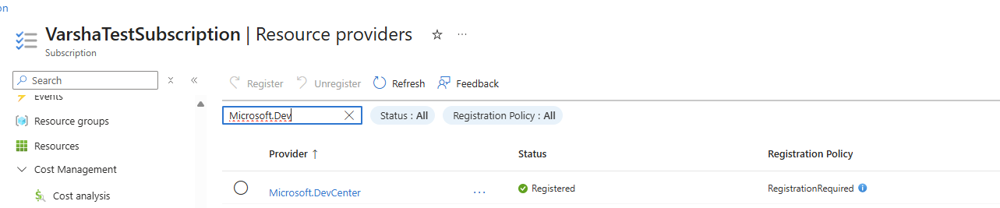

# Dev Box Setup
## Enable the Dev Box Service
1. Once you enter the Microsoft Dev Box page in Azure, you will need to run a script to complete the last step of enabling the private preview.  
2. Click on ‘Get Script’. This will lead you to the Harstine Repository where you will see a scripts folder. Follow the steps in the associated README to run this script. 
  
- To visually confirm the registration, navigate to your subscription, go to Settings --> Resource Providers and look up the Microsoft.DevCenter resource provider. You should see that it has been registered. 

For example: 

## Create a Dev Center
Create a Dev Center resource to begin resource setup. The Dev Center usually represents your enterprise or organization using the Dev Box service. 
1. Click on ‘Dev Centers’ in the left hand panel to begin Dev Center creation. Click on "Create" and fill in the basics. 
2. You will notice that you can enable the Microsoft Hosted Network when viewing your Dev Center Settings. If you do not plan to use MHN, you can deselect this capability. Otherwise, select MHN to avoid Custom Network Creation. 
3. Add appropriate tags, and click on “Review + Create” to create your Dev Center. Navigate to your Dev Center (click on "go to resource") once it is created. 
## Create a Project
Next, create a Dev Box project. A project is the point of access to Microsoft Dev Box for the development team members. 

To finish project set up, you will need access to an existing Entra group. [Learn More](https://learn.microsoft.com/en-us/entra/identity/devices/hybrid-join-plan) 

1. Within your Dev Center, click on Manage --> Projects in the left-hand panel. 
2. Click on "Create"
3. You will need to add basic project information such as the Resource group, subscription, Dev Center, and the project name.  Once that is complete, you can move onto group selection. 

### Assign Users to your Project via Entra Groups 
Group assignment is one of the key capabilities with the new integration with Windows 365. You will now use existing Entra groups to create projects. 
1. During Project creation, navigate to the 'Assignments' tab to start group selection. 
2. Click on 'Add group' to add your entra group to the project resource. These members will have access to create Dev Boxes within the project. 
**Note:** Your groups will not show up automatically. Start typing your group name to find your group.
3. Select your group in the right hand panel and click on 'Add'. 
4. Add necessary Tags and click on 'Review and Create' to create your project. 

## Create a Pool
A dev box pool is a collection of dev boxes that have the same settings, such as the image and network connection. A dev box pool is associated with a Microsoft Dev Box project.

1. Once you have created your project, click into your project (by clicking "go to resource") and select Manage --> Dev Box Pools in the lefthand panel. 
2. Click on '+Create' to start pool creation. 
3. Fill out your pool name, Image, network, and creator priviledges. You can optionally set up SSO. Click on "Create" to finish.  
4. Once your pool is created, all members from your project will have a dev box provisioned. 

## Access your Dev Box
Once you have created your Dev Box, you will be able to access and connect to your dev box using the Windows App. 
Install the Windows App from the Microsoft App Store: https://apps.microsoft.com/detail/9n1f85v9t8bn?hl=en-US&gl=US 
Once you log in, you will see your Dev Box. Click on “Connect”. 
